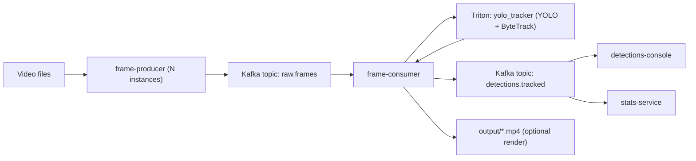

# Kafka Video Processing Pipeline

## 1. Short Description (Methods + Service Responsibilities)

End-to-end pipeline for multi-video tracking using Kafka + Triton (Python backend, YOLO + ByteTrack).

- `frame-producer`: reads one video, samples frames, encodes JPEG, publishes to Kafka topic `raw.frames` (keyed by `video_uuid`).
- `frame-consumer`: consumes `raw.frames`, keeps per-video order, calls Triton with sequence metadata, publishes tracked detections to `detections.tracked`, and optionally renders annotated video.
- `triton (yolo_tracker)`: performs object detection + tracking and keeps tracker state per sequence.
- `detections-console`: prints detections stream for debugging purposes.
- `stats-service`: computes running unique `person`/`car` counts per video and globally.
- `kafka-ui`: topic/message inspection at `http://localhost:8080`.

### Data Structures (Compact)

Kafka payloads are JSON objects:

- `raw.frames` (`event_type=frame`): `video_uuid`, `video_name`, `source_path`, `sampled_frame_id`, `original_frame_id`, `timestamp_ms`, `fps`, `width`, `height`, `image_format=jpeg`, `image_base64`.
- `raw.frames` (`event_type=end_of_stream`): `video_uuid`, `video_name`, `source_path`, `last_sampled_frame_id`, `last_original_frame_id`, `timestamp_ms`.
- `detections.tracked`: `video_uuid`, `video_name`, `sampled_frame_id`, `original_frame_id`, `timestamp_ms`, `detections`.

Each detection item contains:

- `track_id`, `global_track_id`, `class_name`, `confidence`, `bbox_xyxy`.

`bbox_xyxy` format is `[x1, y1, x2, y2]`.

### Frame Encoding + UUID + Write-Back Flow

- Producer frame encoding: OpenCV frame (`HxWx3`) -> JPEG (`cv2.imencode`) -> base64 string in `image_base64`.
- Consumer decoding: base64 -> JPEG bytes -> OpenCV frame -> Triton inference request.
- Producer creates a new `video_uuid` on every run, even for the same source file.
- `video_uuid` is the Kafka key for both topics and is mapped to a stable Triton `sequence_id` (`sha256(video_uuid)` based), so sequence state is per video run.
- Triton detections are converted to JSON and published back to `detections.tracked` with the same `video_uuid` key.
- `global_track_id` is written as `video_uuid:class_name:track_id`, which lets downstream services deduplicate and aggregate by stream/object identity.

## 2. Service Interaction Diagram



## 3. Design Choices and Known Limitations

### Design Choices

- Uses `video_uuid` as Kafka key to preserve per-video ordering within a partition.
- Uses Triton sequence processing so tracker state is kept per video stream.
- Commits processed frame offsets incrementally for near-real-time progress.
- Flushes produced detections before committing input offsets to reduce output/input skew.
- Runs deterministic CPU-oriented defaults in compose for reproducibility.

### Known Limitations

- Base64 JPEG frames make Kafka messages large.
- Per-frame commit strategy may still produce duplicates after crash/restart.
- Tracker state is in Triton memory; restart can break track continuity.
- Default stack is CPU-based and slower than GPU deployments.
- Rendering annotated output increases CPU/disk usage.

## 4. How to Start the Service

From this directory:

```bash
docker compose up --build
```

Useful endpoints:

- Kafka UI: `http://localhost:8080`
- Triton HTTP: `localhost:8000`
- Triton gRPC: `localhost:8001`
- Triton metrics: `localhost:8002`

Optional visualizer profile:

```bash
docker compose --profile visualizer up --build
```

## 5. E2E Run Results (2 Videos)

| Video | Frames processed | Unique people | Unique cars |
| --- | ---: | ---: | ---: |
| `example.mp4` | 144 | 31 | 8 |
| `example_3.mp4` | 1747 | 318 | 10 |
| **Total (2 videos)** | **1891** | **349** | **18** |
