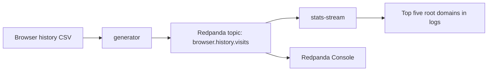

# Browser History Kafka Root Domain Stats

Repository: [github.com/MarkoKostiv/browser-history-kafka-stats](https://github.com/MarkoKostiv/browser-history-kafka-stats)

A small Redpanda/Kafka streaming project for counting visits by browser-history root domain/TLD (`com`, `ua`, `org`, `edu`, etc.) and printing the top five.

## What Is Implemented

- `generator` microservice: reads a browser-history CSV row by row and publishes each visit as a Kafka message.
- `stats-stream` microservice: consumes the visit stream, aggregates counts by root domain/TLD, and prints running plus final top-five statistics.
- Redpanda broker and Redpanda Console in Docker Compose.
- A safe sample dataset in `data/sample_history.csv`.
- A local Chromium-history exporter for Chrome, Brave, Edge, or Chromium.

## Architecture



## Run With The Sample Dataset

From this directory:

```bash
docker compose down -v --remove-orphans
docker compose up --build
```

Watch the output from `stats-stream`. With the included sample CSV, the final result should be:

```text
[stats-stream] FINAL top 5 root domains ...
1. com 10 visits
2. ua  6 visits
3. org 5 visits
4. edu 4 visits
5. net 3 visits
```

Redpanda Console is available at [http://localhost:8080](http://localhost:8080). The Kafka broker is exposed on `localhost:19092`.

## Run With Your Own Browser History

The exporter supports Chromium-based browsers on macOS. It copies the browser SQLite database before reading it, so it does not modify your browser data.

```bash
python3 -m venv .venv
source .venv/bin/activate
pip install -r requirements.txt
python scripts/export_chromium_history.py --browser chrome --profile Default --limit 1000 --output data/browser_history.csv
```

Then run the pipeline with the exported CSV mounted into the app container:

```bash
docker compose down -v --remove-orphans
HISTORY_CSV=/app/data/browser_history.csv docker compose up --build
```

Useful browser options:

```bash
python scripts/export_chromium_history.py --browser brave --profile Default --output data/browser_history.csv
python scripts/export_chromium_history.py --browser edge --profile Default --output data/browser_history.csv
python scripts/export_chromium_history.py --history-db ~/path/to/History --output data/browser_history.csv
```

`data/browser_history.csv` is ignored by Git so private history exports do not get committed accidentally.

## Message Format

The generator writes three event types to `browser.history.visits`.

```json
{"event_type":"run_started","run_id":"...","source_file":"...","emitted_at":"..."}
```

```json
{"event_type":"visit","run_id":"...","sequence":1,"url":"https://ucu.edu.ua/","title":"UCU","visit_time":"...","hostname":"ucu.edu.ua","root_domain":"ua","countable":true}
```

```json
{"event_type":"end_of_stream","run_id":"...","sent_count":31,"countable_count":29,"skipped_count":2,"emitted_at":"..."}
```

Rows like `chrome://settings` and `file:///...` are still sent as messages, but `stats-stream` skips them because they do not have a countable web root domain.

## Configuration

| Variable | Default | Used By | Description |
| --- | --- | --- | --- |
| `KAFKA_BOOTSTRAP_SERVERS` | `localhost:19092` locally, `redpanda:9092` in Compose | both | Kafka/Redpanda broker address. |
| `HISTORY_TOPIC` | `browser.history.visits` | both | Topic containing browser visit events. |
| `HISTORY_CSV` | `data/sample_history.csv` locally, `/app/data/sample_history.csv` in Compose | generator | CSV file to stream. |
| `RUN_ID` | random short UUID | generator | Optional run identifier. |
| `GENERATOR_STARTUP_SLEEP_SECONDS` | `0` locally, `3` in Compose | generator | Gives the consumer time to subscribe before producing. |
| `GENERATOR_ROW_DELAY_SECONDS` | `0` | generator | Optional delay between visit messages for easier live demos. |
| `STATS_GROUP_ID` | `browser-history-stats` | stats-stream | Kafka consumer group id. |
| `STATS_AUTO_OFFSET_RESET` | `latest` | stats-stream | Use `earliest` to replay existing topic data. |
| `TOP_N` | `5` | stats-stream | Number of domains printed. |
| `PRINT_EVERY_MESSAGES` | `25` | stats-stream | Running-statistics print interval. |


## Report

A ready-to-fill report template is in `docs/report.md`. After running the project with your browser-history CSV, capture the terminal output showing the final top five domains and place it in `docs/screenshots/top-five-domains.png`.
