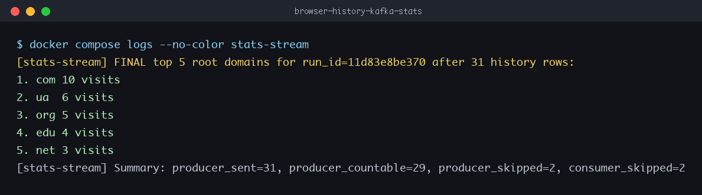

# Report: Browser History Kafka Streaming Application

## 1. Source Code Repository

Repository: [github.com/MarkoKostiv/browser-history-kafka-stats](https://github.com/MarkoKostiv/video-kafka-pipeline/browser-history-kafka-stats)

## 2. How To Run

```bash
git clone https://github.com/MarkoKostiv/browser-history-kafka-stats.git
cd browser-history-kafka-stats
docker compose down -v --remove-orphans
docker compose up --build
```

The sample dataset is `data/sample_history.csv`.

To run with a private Chromium-based browser export on macOS:

```bash
python3 -m venv .venv
source .venv/bin/activate
pip install -r requirements.txt
python scripts/export_chromium_history.py --browser chrome --profile Default --limit 1000 --output data/browser_history.csv

docker compose down -v --remove-orphans
HISTORY_CSV=/app/data/browser_history.csv docker compose up --build
```

## 3. Implementation Summary

The project contains two Python microservices and a Redpanda broker:

- `generator`: reads each CSV row, extracts the hostname and root domain/TLD, and publishes one Kafka JSON message per history row.
- `stats-stream`: consumes `browser.history.visits`, aggregates visits by `root_domain`, and prints the top five domains when the generator sends `end_of_stream`.
- `redpanda-console`: optional UI for inspecting the Kafka topic at `http://localhost:8080`.

The task examples treat `com`, `ua`, `org`, `edu`, etc. as the root domain, so the implementation uses the last hostname label as the counted root domain/TLD.

## 4. Screenshot Of Top Five Domains

Place the captured terminal screenshot here after running with your exported browser history:



For the included sample dataset, the expected final output is:

```text
1. com 10 visits
2. ua  6 visits
3. org 5 visits
4. edu 4 visits
5. net 3 visits
```
