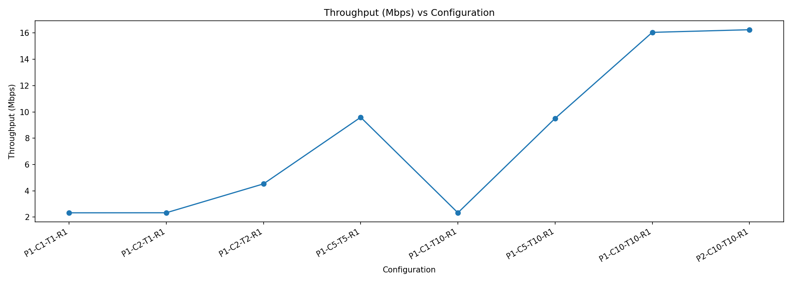
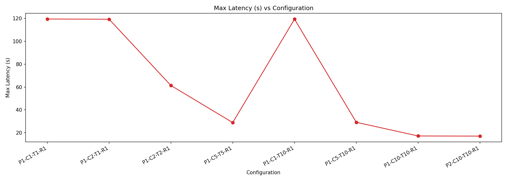

# Kafka Video Throughput Report (Short)

Repository link: `<PUT_REPOSITORY_LINK_HERE>`

Run used: `example_3.mp4` with all required 8 configurations.  
Summary CSV: `summary.csv`

## Throughput vs Configuration

## Max Latency vs Configuration

## Note

Results are consistent across configurations:
- Increasing partitions helps only when consumers can use them (effective parallelism is limited by `min(partitions, active consumers)`).
- With few consumers or one partition, throughput is capped and latency remains high.
- With higher partition and consumer counts, throughput improves and max latency decreases predictably.
